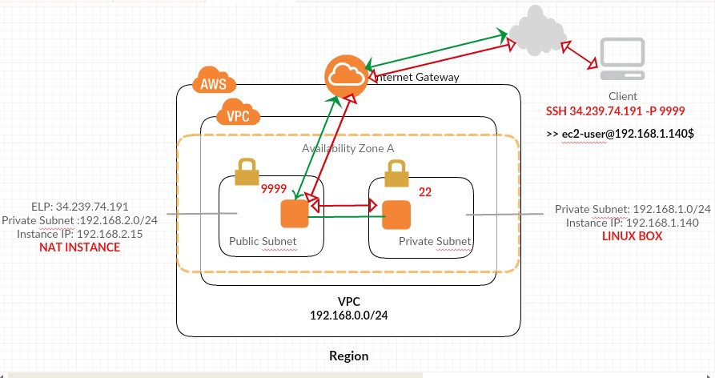

# Creating Virtual Private Network on AWS to deploy 2tier application

## Steps:
- Create a VPC 'eng89_infra_prathima_vpc' with CIDR 10.210.0.0./16
- Create an Internet Gateway 'eng89_infra_prathima-ig' and attach VPC that was created previusly.
- Create two subnets using the same VPC that we created previously (eng89_infra_prathima_subnet_public(IPv4 = 10.21.1.0/24) & eng89_infra_prathima_subnet_private(IPv4 = 10.21.2.0/24)), choose same Ireland/eu-west-1a for Availability Zone 
- Create Route Table 'eng89_infra_prathima_route_internet' and attach VPC
 - Edit the routes by adding rule Destination: 0.0.0.0/0 and Target: Internet Gateway that is created. 

 - Open a subnet (public) change Edit the route table association to the one we have just created.

- Create Security Group  for the application as 'eng89_infra_prathima_SG_app' and connect to the VPC that is created.
 * Edit the inbound rules 
 ```
 'Type:HTTP, Port:80, Source: Anywhere: 0.0.0.0/0'
 'Type:SSH, Port:22, Source: MyIP:x.x.x.x/32'
```

- Create Security Group for the database 'eng89_infra_prathima_SG_db' and connect to the VPC that is created.
 * Edit the inbound rules 
 ```
 Type:HTTP, Port:80, Source: Custom: eng89_infra_prathima_SG_app
 Type:SSH, Port:22, Source: Custom:10.210.3.0/32 (Bostion server)
```
### Create Network ACL 'eng89_infra_prathima_nacl' and attach 'eng89_infra_prathima_vpc'and update the Subnet Associations with 'eng89_infra_prathima_subnet_public'
- Open the 'eng89_infra_prathima_nacl' 
  * Edit Inbound rules
  ```
  Role number: 100, Type: HTTP, port: 80, Source: 0.0.0.0/0
  Role number: 110, Type: SSH, port: 22, Source: x.x.x.x/32 (MyIP)
  Role number: 120, Type: Custom TCP, port: 1024-65535, Source: 0.0.0.0/0
  ```
 * Edit Outbound rules
 ```
  Role number: 100, Type: HTTP, port: 80, Source: 0.0.0.0/0
  Role number: 110, Type: Custom TCP, port: 27017, Source: 10.210.2.0/24 (app)
  Role number: 120, Type: Custom TCP, port: 1024-65535, Source: 0.0.0.0/0
 ```
- Create the public Network ACL as 'eng89_infra_prathima_nacl_public' and update the Subnet Associations with 'eng89_infra_prathima_subnet_public'
  * Edit Inbound rules
  ```
  Role number: 100, Type: HTTP, port: 80, Source: 0.0.0.0/0
  Role number: 110, Type: SSH, port: 22, Source: x.x.x.x/32 (MyIP)
  Role number: 120, Type: Custom TCP, port: 1024-65535, Source: 0.0.0.0/0
  ```
 * Edit Outbound rules
 ```
  Role number: 100, Type: HTTP, port: 80, Source: 0.0.0.0/0
  Role number: 110, Type: Custom TCP, port: 27017, Source: 10.210.2.0/24 (app)
  Role number: 120, Type: Custom TCP, port: 1024-65535, Source: 0.0.0.0/0
 ```
- Create the private Network ACL as 'eng89_infra_prathima_nacl_private' and update the Subnet Associations with 'eng89_infra_prathima_subnet_private'
  * Edit Inbound rules
  ```
  Role number: 100, Type: HTTP, port: 80, Source: 0.0.0.0/0
  Role number: 110, Type: SSH, port: 22, Source: x.x.x.x/32 (MyIP)
  Role number: 120, Type: Custom TCP, port: 1024-65535, Source: 0.0.0.0/0
  ```
 * Edit Outbound rules
 ```
  Role number: 100, Type: HTTP, port: 80, Source: 0.0.0.0/0
  Role number: 110, Type: Custom TCP, port: 1024-65535, Source: 10.210.1.0/24 (app)
  Role number: 120, Type: Custom TCP, port: 1024-65535, Source: 10.210.3.0/24 (bastion)
 ```
### Create EC2 instances for 'webapp server', 'db server' with the VPC that is created & SG groups accordingly

### Create a new Subnet for Bastion server 'eng89_infra_prathima_subnet_bastion'
- Edit route table and choose the one created instead of default route

### Create a Network ACL for Bastion Server 'eng89_infra_prathima_nacl_bastion' and attach with the VPC

